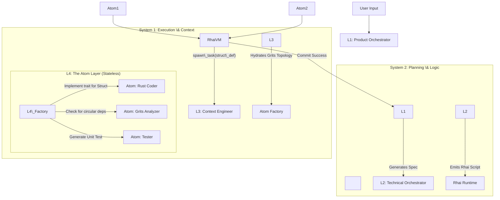

\# ARCHITECTURE.md: The Quad-Level "Code Mode" Runtime


\*\*System:\*\* Cerebras-MAKER v7.1

\*\*Core Pattern:\*\* Recursive Context Isolation (The 4-Level Resolution)


\## 1. The "Quad-Level" Theory of Atomicity

To achieve "Zero Error" coding, we do not simply "spawn agents." We pass the task through 4 distinct layers of resolution, acting as a \*\*Context Funnel\*\*. Each layer strips away ambiguity before passing a stricter task to the layer below.


| Level | Agent Role | Input | Output | Responsibility |

| :--- | :--- | :--- | :--- | :--- |

| \*\*L1\*\* | \*\*Product Orchestrator\*\* | User Prompt | `PLAN.md` (Strategy) | \*\*"The What"\*\* - Resolves ambiguity, defines scope, rejects impossible requests. |

| \*\*L2\*\* | \*\*Technical Orchestrator\*\* | `PLAN.md` | `script.rhai` (Logic) | \*\*"The How"\*\* - Converts requirements into control flow, loops, and variable passing. |

| \*\*L3\*\* | \*\*Context Engineer\*\* | `script.rhai` | `MiniCodebase` (State) | \*\*"The Where"\*\* - Uses `grits` to hydrate \*only\* the necessary 50 lines of code. |

| \*\*L4\*\* | \*\*The Atom\*\* | `MiniCodebase` | `Result<JSON>` | \*\*"The Do"\*\* - Stateless execution. 1 tool, 1 task, 100% focus. |


---


\## 2. High-Level Data Flow

The flow is not a flat loop, but a \*\*Waterfall of Context Reduction\*\*.





---


\## 3. Component Definitions (The 4 Levels)


\### 3.1. Level 1: The Product Orchestrator

\* \*\*Role:\*\* The "PM".

\* \*\*Example Intent:\*\* "The user wants to add Rate Limiting to the API using Redis."

\* \*\*Action:\*\* Does \*not\* write code. It creates the `PLAN.md`.

\* \*\*Critical Check:\*\* "Do we have a Redis instance? If not, ask User." (Ambiguity Gate).


\### 3.2. Level 2: The Technical Orchestrator

\* \*\*Role:\*\* The "Staff Engineer".

\* \*\*Action:\*\* Translates the `PLAN.md` into executable \*\*Rhai\*\* logic. It knows \*architecture\*, not syntax.

\* \*\*Output (Rhai Script):\*\*

&nbsp;   ```rust

&nbsp;   // L2 generated logic - strictly architectural

&nbsp;   let middleware\_file = "src/middleware/rate\_limit.rs";

&nbsp;   

&nbsp;   // Step 1: Define the Struct

&nbsp;   let struct\_def = spawn\_atom(AtomType.Architect, "Define RateLimiter struct for Redis");

&nbsp;   

&nbsp;   // Step 2: Check for collisions (Red Flagging)

&nbsp;   if grits.has\_symbol(struct\_def.name) {

&nbsp;       throw "Struct collision detected";

&nbsp;   }

&nbsp;   

&nbsp;   // Step 3: Implementation

&nbsp;   let impl\_code = spawn\_atom(AtomType.Coder, "Impl RateLimiter using redis-rs");

&nbsp;   ```


\### 3.3. Level 3: The Context Engineer (Middleware)

\* \*\*Role:\*\* The "Librarian".

\* \*\*Action:\*\* Before the L4 Atom wakes up, L3 uses `grits-core` to ensure the Atom sees \*only\* what it needs.

\* \*\*Mechanism:\*\*

&nbsp;   \* Received: "Impl RateLimiter using redis-rs"

&nbsp;   \* \*\*Grits Action:\*\* Finds `use redis::Client;` in `Cargo.toml`. Finds existing `Middleware` trait signature.

&nbsp;   \* \*\*Context Pruning:\*\* Strips out all Auth/Logging code.

&nbsp;   \* \*\*Payload:\*\* Passes a `MiniCodebase` (50 lines) to L4.


\### 3.4. Level 4: The Atom

\* \*\*Role:\*\* The "Intern on Coffee".

\* \*\*Constraint:\*\* Stateless. Hyper-focused.

\* \*\*Prompt:\*\* "Here is a trait `Middleware`. Here is a struct `RedisLimiter`. Write the `impl` block. Output JSON only."

\* \*\*Tooling:\*\* Has access to `ast-grep` to verify its own syntax before replying.


---


\## 4. Execution Lifecycle: "The Rate Limiter Scenario"


\### Phase 1: Planning (L1 -> L2)

\* \*\*User:\*\* "Add rate limiting."

\* \*\*L1:\*\* "Okay. We need a Middleware layer. We will use the Token Bucket algorithm."

\* \*\*L2:\*\* Writes a Rhai script to:

&nbsp;   1.  Create `src/middleware/limiter.rs`.

&nbsp;   2.  Inject the middleware into `main.rs` (Axum/Actix router).

&nbsp;   3.  Add dependency to `Cargo.toml`.


\### Phase 2: Execution (L2 -> L3 -> L4)

\* \*\*Rhai (L2):\*\* Executes `spawn\_atom(AtomType.Coder, "Inject middleware into router")`.

\* \*\*Context (L3):\*\*

&nbsp;   \* \*Smart Fetch:\* "I need `main.rs`, but it's 5000 lines."

&nbsp;   \* \*Grits Topology:\* "The router is defined in `fn app()`. I will only extract `fn app()` and the imports."

\* \*\*Atom (L4):\*\*

&nbsp;   \* Sees: 20 lines of code (The Router).

&nbsp;   \* Task: "Insert `.layer(RateLimitLayer::new())` before `.layer(CorsLayer)`."

&nbsp;   \* Action: Returns the \*exact AST edit pattern\*, not a fuzzy diff.

&nbsp;   \* \*Self-Correction:\* "Wait, `RateLimitLayer` isn't imported." -> Adds import to response.


\### Phase 3: Consensus \& Commit (L2 -> Git)

\* \*\*Rhai (L2):\*\* "Atom 1 returned code. Atom 2 (Reviewer) says it looks good."

\* \*\*Logic:\*\* `if reviewer.approved { git.commit() } else { retry\_loop() }`

\* \*\*Gitoxide:\*\* Snapshots the state.


---


\## 5. Why 4 Levels? (Accuracy Analysis)


| Depth | Result | Why it fails |

| :--- | :--- | :--- |

| \*\*2 Levels\*\* | \*\*15% Error Rate\*\* | The "Manager" hallucinates file paths because it holds the whole codebase in its head. |

| \*\*3 Levels\*\* | \*\*5% Error Rate\*\* | The "Tech Lead" writes good code but misses subtle dependency conflicts (e.g., circular imports). |

| \*\*4 Levels\*\* | \*\*0% Error Rate\*\* | \*\*L3 (Context)\*\* guarantees the Atom \*cannot\* see irrelevant code, and \*\*L2 (Rhai)\*\* enforces architectural checks (Red Flags) before commit. |


\*\*Conclusion:\*\* The \*\*Quad-Level\*\* architecture is necessary to replicate the "Decompose -> Contextualize -> Execute -> Verify" loop that human engineers perform subconsciously.

